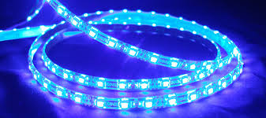

# El Objetivo de este repositorio

## Descubriendo el mundo de los diodos LED: Tipos, Potencia y Aplicaciones

### Introducción

Adéntrate en el fascinante mundo de los diodos LED, componentes electrónicos esenciales en nuestra vida cotidiana. En este repositorio exploraremos los diferentes tipos de LEDs, su potencia y la amplia gama de aplicaciones que tienen en diversos campos.

### Tipos de LEDs

* **LEDs de un solo color:** Rojos, verdes, azules, amarillos, etc., ideales para señalización e iluminación básica.
* **LEDs RGB:** Combinan los colores primarios para crear una amplia gama de tonos y efectos.
* **LEDs SMD:** Tamaño miniatura para aplicaciones donde el espacio es limitado.
* **LEDs de alta potencia:** Iluminación potente para proyectos que requieren mayor brillo.

### Potencia de los LEDs

* **Baja potencia (menos de 20 mA):** Ideales para circuitos simples y aplicaciones de bajo consumo.
* **Potencia media (20-50 mA):** Utilizados en iluminación general y proyectos que requieren mayor brillo.
* **Alta potencia (más de 50 mA):** Iluminación potente para proyectos de alta intensidad y exteriores.
